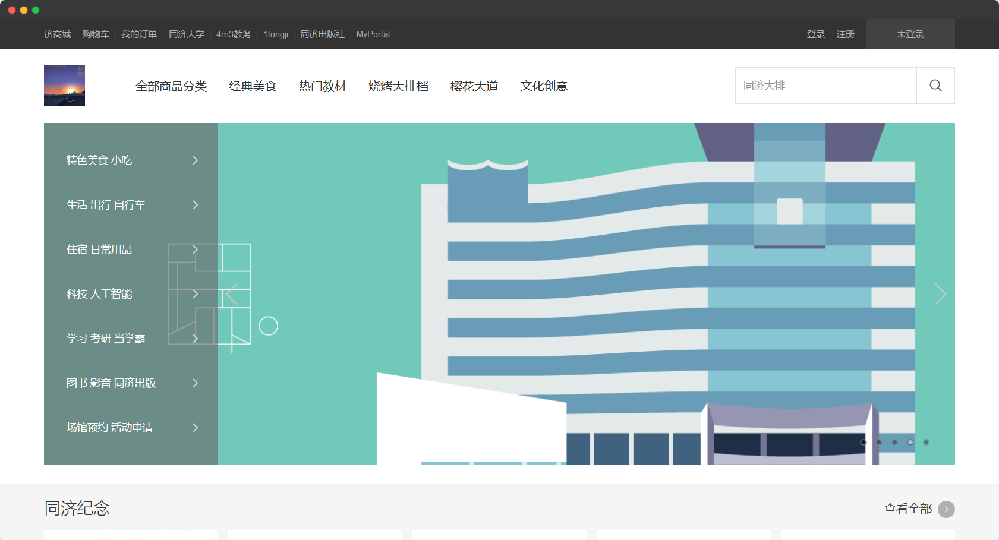
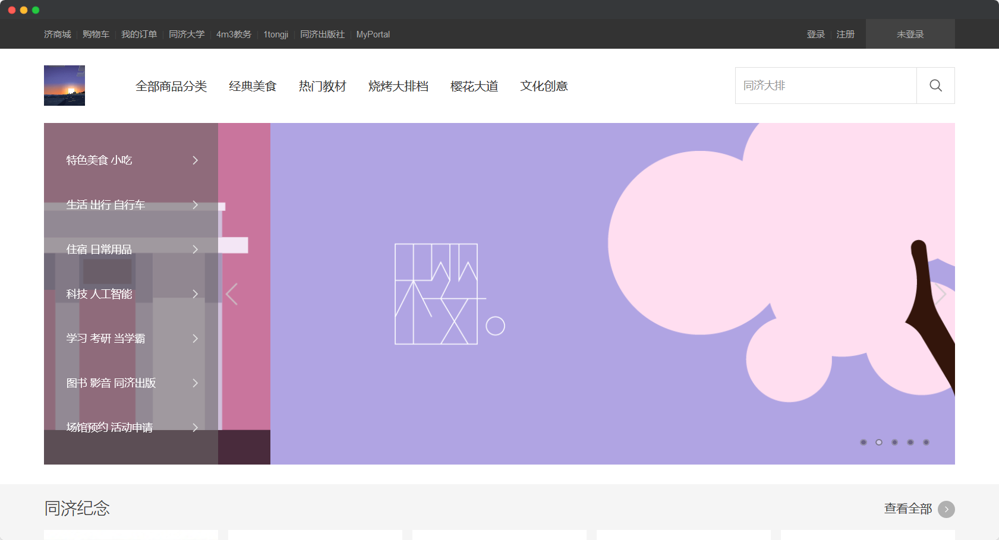
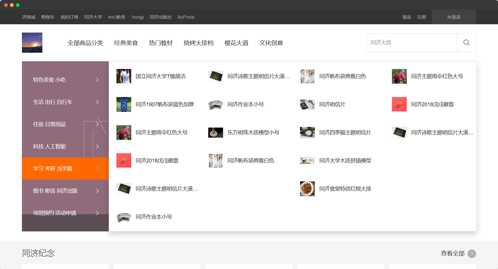
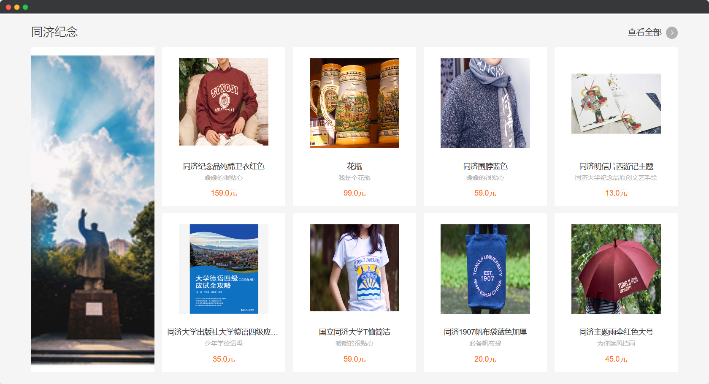
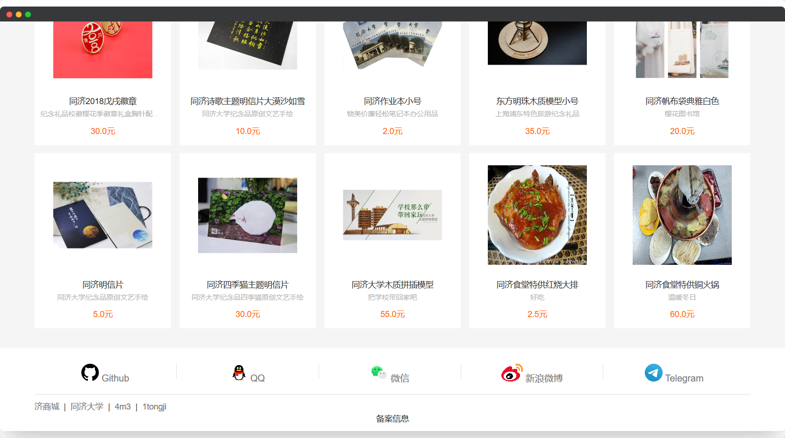
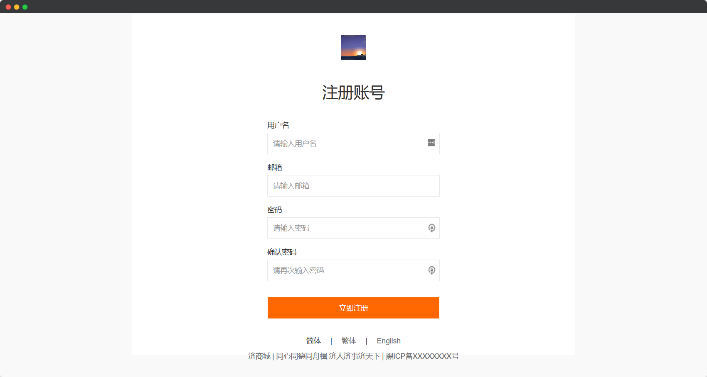
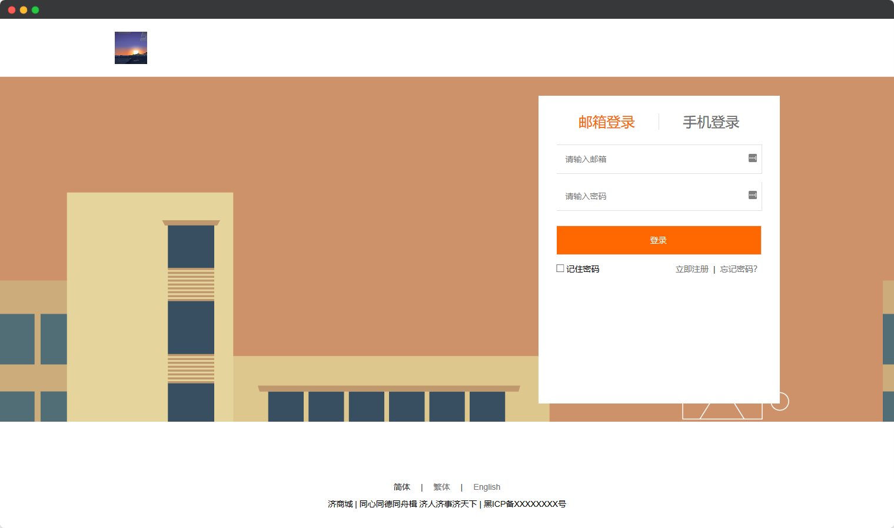
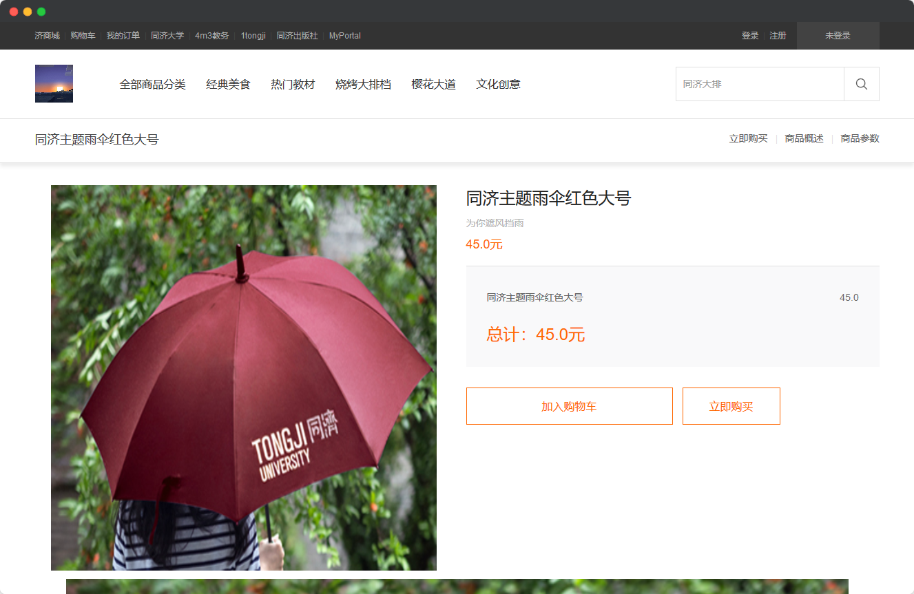
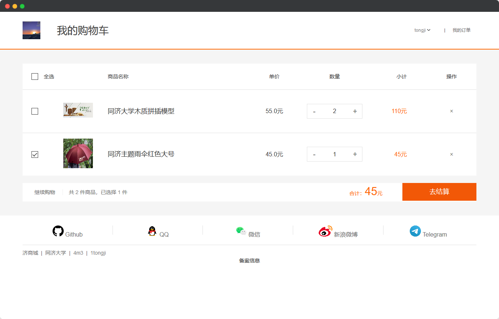
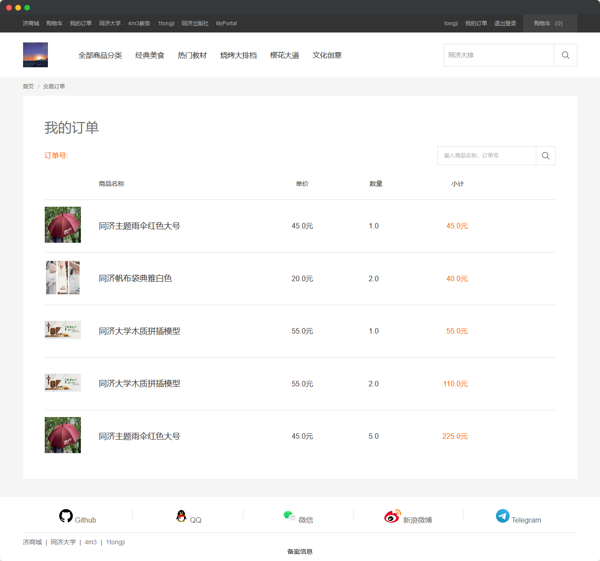

# Tongji-e-shop - **纯原生**实现基本电商平台

> 🌐 [同济商城 | tongji-e-shop](https://tongji-e-shop.herokuapp.com/)

> 🎥 [展示视频 | Intro Video](./video.mp4)

[TOC]

---

## 实现功能

- 商城首页

  - **双层导航栏 (复杂 JS 组件)**

    - 页面导航
    - 商品分类导航
    - 购物车数量指示灯
    - 已登录/未登录显示不同内容

  - **首页轮播图 (复杂 JS 组件)**

  - 商品展示

    - 商品缩略图, 名称, 描述, 价格
    - 卡片式展示风格
    - **浮动渐变效果**

- 商品详情页

  - 基本信息

    - 商品大图, 名称, 描述, 价格
    - 商品详细参数(页面主体)
    - 使用 hashTag - 快速跳转

  - 加入购物车

    - 未登陆: 跳转到登录页
    - 已登陆: 购物车+1

  - 立即购买

    - 未登陆: 跳转到登录页
    - 已登陆: 跳转到订单页

- 注册 / 登录页

  - 非空监测
  - 二次密码确认
  - **重复检测** - 针对用户名/邮箱/手机号
  - **成功后自动跳转到之前访问页面**

- 查看购物车

  - 基本信息列表

    - 商品缩略图
    - 名称, 描述, 价格

  - 购物车调整

    - 批量选择
    - 数量微调
    - 从购物车中删除
    - **自动更新总价格**

  - 立即结算 (支付过程省略)

- 查看历史订单

  - 查看我的购物记录 (不可修改)

- **数据持久化**

  > 后端 轻量级 Python Web 框架 [Flask](https://flask.palletsprojects.com/en/1.1.x/)

  > 数据库 [MySQL](https://www.mysql.com/)

  > ORM 框架 [Flask-SQLAlchemy](https://flask-sqlalchemy.palletsprojects.com/en/2.x/)

- **远程部署**

  > 部署地址 https://tongji-e-shop.herokuapp.com/

## 界面设计

### 首页



#### 轮播图细节



#### 商品分类



#### 商品展示



#### 外部链接



---

### 注册 / 登陆

#### 注册



#### 登陆



---

### 商品购买



---

### 购物车



#### 历史订单



## 开发工具

- 操作系统

  - 开发环境: Windows 10
  - 生产环境: Ubuntu 18.04 LTS

- IDE

  - Visual Studio Code

- 开发工具

  - HTML5
  - CSS3, **Sass**
  - JavaScript, **Gulp**
  - **Python**

- 数据库

  - **MariaDB** (MySQL)

- 框架技术

  - 前端: 原生 HTML + CSS + JavaScript
  - 后端: Flask + SQLAlchemy + MySQL

## 部分实现

### 前端

#### 原生 Ajax 封装

```javascript
function ajax(options = {}) {
    let { url, type, data, success, fail, contentType, rawdata } = options;
    type = (type || "GET").toUpperCase();
    contentType = contentType || "application/x-www-form-urlencoded"
    let params = rawdata || toParams(data);

    let xhr = new XMLHttpRequest();
    xhr.onreadystatechange = () => {
        if (xhr.readyState === 4) {
            if (xhr.status >= 200 && xhr.status < 300) {
                success && success(JSON.parse(xhr.responseText));
            } else if (xhr.status >= 400) {
                fail && fail(JSON.parse(xhr.responseText));
            }
        }
    };

    if (type === "GET") {
        xhr.open(type, url + (params || '?') + params);
        xhr.send();
    } else {
        xhr.open(type, url);
        xhr.setRequestHeader('Content-Type', contentType);
        xhr.send(params);
    }
}
```

---

### 后端

#### Controller

```python
@app.route('/api/login', methods=["POST"])
def api_login():
    email = request.form.get('email')
    password = request.form.get('password')
    user = User.query.filter(User.email == email).first()
    if user and user.password == password:
        session['id'] = user._id
        return jsonify({'status': 'ok', 'location': url_for('index')})
    else:
        return jsonify({'status': 'error'}), 400
```

---

### 数据库

#### ORM

```python
class Item(db.Model):
    '''商品'''
    __tablename__ = 'item'
    _id = db.Column(db.Integer, primary_key=True)
    name = db.Column(db.String(255), nullable=False)
    price = db.Column(db.Float, nullable=False)
    image = db.Column(db.Text)
    desc = db.Column(db.Text)
    time = db.Column(db.DateTime, default=datetime.now, onupdate=datetime.now)
```

## 项目结构

```
.
├── README.md
├── app.py
├── data.sql
├── db.mwb
├── db.sql
├── gulpfile.js
├── node_modules
│   └── ...
├── images
│   └── ...
├── static
│   ├── css
│   │   ├── cart.css
│   │   ├── common.css
│   │   ├── footer.css
│   │   ├── header.css
│   │   ├── index.css
│   │   ├── login.css
│   │   ├── order.css
│   │   ├── product.css
│   │   ├── register.css
│   │   └── span.css
│   ├── image
│   │   └── ...
│   └── js
│       ├── ajax.js
│       ├── cart.js
│       ├── header.js
│       ├── index.js
│       ├── login.js
│       ├── product.js
│       └── register.js
└── templates
    ├── cart.html
    ├── index.html
    ├── login.html
    ├── order.html
    ├── product.html
    └── register.html
```
